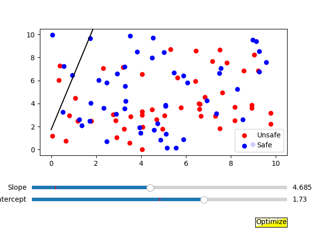

# Linear Classification Simulation

Welcome to the linear classification simulation repository. This interactive Python script serves as an educational tool to illustrate the basic principles of machine learning, specifically focusing on the task of linear classification.

## Overview

The script generates a two-dimensional scatter plot with two categories of points, 'Unsafe' and 'Safe', which are to be separated by a decision boundary. Users can interactively adjust this boundary and run an optimization routine to improve the separation. This hands-on approach is designed to help users grasp the mechanics behind linear classifiers in AI.

## Features

- **Interactive Sliders**: Control the slope and intercept of the decision boundary.
- **Optimization Button**: Automatically adjust the boundary for better classification.
- **Performance Evaluation**: Count and display the number of correctly classified points.
- **Result Exporting**: Save the simulation results into a text file for further analysis.
- **Visualization**: Use matplotlib for real-time plotting and visualization.
- **Threading**: Perform background simulations without freezing the GUI.
- **Console Outputs**: Provide immediate feedback on the current state of the system.

## Getting Started

To get started with the simulation:

1. Ensure you have Python installed on your system.
2. Install the required Python libraries with `pip install numpy matplotlib`.
3. Clone this repository to your local machine.
4. Run the script using `python forest.py`.
5. Use the interactive sliders to adjust the decision boundary and the 'Optimize' button to automatically find a better separating line.

## Screenshot

*Screenshot of the simulation in action.*

## How It Works

- The script generates random points representing two classes using `numpy`.
- It uses `matplotlib` to plot these points and a decision boundary line.
- Interactive sliders allow you to adjust the decision boundary in real-time.
- The 'Optimize' button triggers an optimization algorithm that iteratively adjusts the boundary to improve classification accuracy.
- The results are printed in the console and exported to a `.txt` file for documentation.

## Collaboration

This project was 100% made with the collaboration of OpenAI's ChatGPT, which provided guidance and assistance throughout the development process.

## Contributing

Your contributions are what make the open-source community such an amazing place to learn, inspire, and create. Any contributions you make are **greatly appreciated**.

If you have a suggestion that would make this better, please fork the repo and create a pull request. You can also simply open an issue with the tag "enhancement".

Don't forget to give the project a star! Thanks again!

## License

Distributed under the MIT License. See `LICENSE` for more information.

## Acknowledgments

- This project is created for educational purposes and is not intended for production use.
- Inspired by the simplicity and power of linear classifiers in the field of machine learning.
- Special thanks to the Python community and the developers of `numpy` and `matplotlib`.
